// Success Response
{
  "success": true,
  "data": {
    // Datos solicitados
  },
  "meta": {
    "timestamp": "2025-11-03T10:30:00Z",
    "requestId": "req_abc123"
  }
}

// Success Response con paginación
{
  "success": true,
  "data": [...],
  "pagination": {
    "page": 1,
    "limit": 20,
    "total": 150,
    "totalPages": 8,
    "hasNext": true,
    "hasPrev": false
  }
}

// Error Response
{
  "success": false,
  "error": {
    "code": "VALIDATION_ERROR",
    "message": "Email inválido",
    "details": {
      "field": "email",
      "value": "invalid-email"
    }
  },
  "meta": {
    "timestamp": "2025-11-03T10:30:00Z",
    "requestId": "req_abc123"
  }
}

// Códigos de error estándar
const ErrorCodes = {
  // Auth (401)
  UNAUTHORIZED: 'No autenticado',
  INVALID_CREDENTIALS: 'Credenciales inválidas',
  TOKEN_EXPIRED: 'Token expirado',
  
  // Permisos (403)
  FORBIDDEN: 'Sin permisos',
  ROLE_REQUIRED: 'Rol insuficiente',
  
  // Not Found (404)
  NOT_FOUND: 'Recurso no encontrado',
  USER_NOT_FOUND: 'Usuario no encontrado',
  PROJECT_NOT_FOUND: 'Proyecto no encontrado',
  
  // Validation (400)
  VALIDATION_ERROR: 'Error de validación',
  INVALID_INPUT: 'Entrada inválida',
  MISSING_FIELD: 'Campo requerido faltante',
  
  // Rate Limit (429)
  RATE_LIMIT_EXCEEDED: 'Demasiadas solicitudes',
  
  // Server (500)
  INTERNAL_ERROR: 'Error interno del servidor',
  DATABASE_ERROR: 'Error de base de datos'
};
```

---

## 🗄️ Database Schema y Relaciones

### Diagrama Entidad-Relación

```
┌──────────────┐
│     User     │
├──────────────┤
│ id (PK)      │
│ email        │
│ passwordHash │
│ role         │◄────────┐
│ firstName    │         │
│ lastName     │         │
└──────┬───────┘         │
       │                 │
       │ 1:N             │ 1:N
       │                 │
┌──────▼───────┐   ┌─────┴──────┐
│   Project    │   │  Session   │
├──────────────┤   ├────────────┤
│ id (PK)      │   │ id (PK)    │
│ clientId (FK)│   │ userId (FK)│
│ name         │   │ token      │
│ type         │   │ expiresAt  │
│ status       │   └────────────┘
│ budget       │
│ progress     │
└──────┬───────┘
       │
       │ 1:N
       │
┌──────▼───────────┐
│    Milestone     │
├──────────────────┤
│ id (PK)          │
│ projectId (FK)   │
│ name             │
│ status           │
│ order            │
│ dueDate          │
└──────────────────┘

       │
       │ 1:N
       ├─────────────────┬─────────────────┬──────────────┐
       │                 │                 │              │
┌──────▼──────┐  ┌───────▼────┐  ┌────────▼──────┐  ┌───▼──────┐
│   Payment   │  │    File    │  │    Message    │  │ Activity │
├─────────────┤  ├────────────┤  ├───────────────┤  ├──────────┤
│ id (PK)     │  │ id (PK)    │  │ id (PK)       │  │ id (PK)  │
│ projectId   │  │ projectId  │  │ projectId (FK)│  │ project  │
│ userId (FK) │  │ name       │  │ userId (FK)   │  │ type     │
│ amount      │  │ url        │  │ content       │  │ descrip. │
│ status      │  │ type       │  │ isRead        │  └──────────┘
│ method      │  └────────────┘  └───────────────┘
└─────────────┘

┌──────────────┐
│     Lead     │
├──────────────┤
│ id (PK)      │
│ name         │
│ email        │
│ serviceType  │
│ budget       │
│ score        │
│ status       │
│ assignedTo   │
└──────────────┘
```

### Índices para Performance

```sql
-- Índices en User
CREATE INDEX idx_user_email ON users(email);
CREATE INDEX idx_user_role ON users(role);

-- Índices en Project
CREATE INDEX idx_project_client ON projects(clientId);
CREATE INDEX idx_project_status ON projects(status);
CREATE INDEX idx_project_created ON projects(createdAt DESC);

-- Índices en Lead
CREATE INDEX idx_lead_status ON leads(status);
CREATE INDEX idx_lead_score ON leads(score DESC);
CREATE INDEX idx_lead_created ON leads(createdAt DESC);
CREATE INDEX idx_lead_assigned ON leads(assignedTo);

-- Índices en Payment
CREATE INDEX idx_payment_project ON payments(projectId);
CREATE INDEX idx_payment_user ON payments(userId);
CREATE INDEX idx_payment_status ON payments(status);
CREATE INDEX idx_payment_created ON payments(createdAt DESC);

-- Índices en Message
CREATE INDEX idx_message_project ON messages(projectId);
CREATE INDEX idx_message_user ON messages(userId);
CREATE INDEX idx_message_created ON messages(createdAt DESC);

-- Índice compuesto para queries comunes
CREATE INDEX idx_project_client_status ON projects(clientId, status);
```

### Queries Optimizadas Comunes

```javascript
// Dashboard del cliente - 1 query optimizada
const clientDashboard = await prisma.user.findUnique({
  where: { id: clientId },
  include: {
    projects: {
      include: {
        milestones: {
          where: { status: { in: ['PENDING', 'IN_PROGRESS'] } },
          orderBy: { order: 'asc' },
          take: 3
        },
        activities: {
          orderBy: { createdAt: 'desc' },
          take: 5
        },
        payments: {
          orderBy: { createdAt: 'desc' }
        }
      }
    }
  }
});

// Dashboard admin - queries separadas para mejor performance
const [
  projectsCount,
  leadsCount,
  revenueThisMonth,
  activeProjects
] = await Promise.all([
  prisma.project.count({ where: { status: 'IN_PROGRESS' } }),
  prisma.lead.count({ where: { status: 'NEW' } }),
  prisma.payment.aggregate({
    where: {
      status: 'COMPLETED',
      createdAt: {
        gte: startOfMonth(),
        lte: endOfMonth()
      }
    },
    _sum: { amount: true }
  }),
  prisma.project.findMany({
    where: { status: { in: ['IN_PROGRESS', 'REVIEW'] } },
    include: {
      client: { select: { firstName: true, lastName: true } },
      milestones: { where: { status: 'IN_PROGRESS' } }
    },
    take: 10
  })
]);
```

---

## 🔄 Flujos de Negocio Críticos

### 1. Flujo de Lead a Cliente

```javascript
// 1. Visitante llena formulario en landing
POST /api/leads
{
  name: "Carlos Ruiz",
  email: "carlos@tiendaropa.cl",
  phone: "+56912345678",
  company: "Tienda de Ropa Elegante",
  serviceType: "ecommerce",
  budget: "2M-3M",
  message: "Necesito urgente tienda online para navidad...",
  utm: {
    source: "google",
    medium: "cpc",
    campaign: "santiago-tienda-online"
  }
}

// 2. Backend procesa y calcula score
const score = calculateLeadScore({
  hasPhone: true,           // +10
  hasCorporateEmail: true,  // +20
  highBudget: true,         // +30
  detailedMessage: true,    // +15
  urgency: true             // +10
}); // Total: 85

// 3. Guarda en BD con status NEW
await prisma.lead.create({
  data: {
    ...leadData,
    score,
    status: 'NEW'
  }
});

// 4. Notifica al equipo
await sendEmail({
  to: 'equipo@arkia.cl',
  subject: '🔥 Nuevo Lead de Alta Prioridad',
  template: 'new-lead',
  data: { lead, score }
});

await sendWhatsApp({
  to: PM_ON_DUTY,
  message: `Nuevo lead: ${name} - Score: ${score}/100`
});

// 5. Admin revisa y contacta
// (manual en admin panel)

// 6. Admin convierte a cliente
POST /api/admin/leads/:leadId/convert
{
  projectDetails: {
    name: "Tienda Online - Ropa Elegante",
    type: "ECOMMERCE",
    budget: 2500000,
    estimatedHours: 150,
    deadline: "2025-12-15"
  },
  clientInfo: {
    firstName: "Carlos",
    lastName: "Ruiz",
    email: "carlos@tiendaropa.cl",
    phone: "+56912345678",
    company: "Tienda de Ropa Elegante"
  }
}

// 7. Backend crea User + Project
const client = await prisma.user.create({
  data: {
    email: clientInfo.email,
    firstName: clientInfo.firstName,
    lastName: clientInfo.lastName,
    phone: clientInfo.phone,
    company: clientInfo.company,
    role: 'CLIENT',
    passwordHash: null, // Se configura después
    isActive: true
  }
});

const project = await prisma.project.create({
  data: {
    ...projectDetails,
    clientId: client.id,
    status: 'APPROVED'
  }
});

// 8. Genera setup token
const setupToken = generateSecureToken();
await redis.setex(
  `setup:${setupToken}`,
  48 * 60 * 60, // 48 horas
  client.id
);

// 9. Envía email de bienvenida
await sendEmail({
  to: client.email,
  subject: 'Bienvenido a ARKIA - Accede a tu Proyecto',
  template: 'client-welcome',
  data: {
    clientName: client.firstName,
    projectName: project.name,
    setupLink: `https://arkia.cl/portal/setup?token=${setupToken}`
  }
});

// 10. Cliente accede y crea contraseña
// (flujo de autenticación)

// 11. Actualiza lead a WON
await prisma.lead.update({
  where: { id: leadId },
  data: { status: 'WON' }
});
```

### 2. Flujo de Actualización de Proyecto

```javascript
// Admin actualiza progreso del proyecto
PATCH /api/admin/projects/:projectId
{
  progress: 75,
  status: 'IN_PROGRESS',
  updateNote: 'Completamos el desarrollo del carrito de compras'
}

// 1. Backend valida y actualiza
await prisma.project.update({
  where: { id: projectId },
  data: {
    progress: 75,
    updatedAt: new Date()
  }
});

// 2. Crea registro de actividad
await prisma.activity.create({
  data: {
    projectId,
    type: 'PROJECT_UPDATED',
    description: 'Progreso actualizado a 75%',
    userId: req.user.id,
    metadata: {
      previousProgress: 60,
      newProgress: 75,
      note: updateNote
    }
  }
});

// 3. Notifica al cliente (si configurado)
const client = await prisma.user.findUnique({
  where: { id: project.clientId },
  include: { 
    notificationPreferences: true 
  }
});

if (client.notificationPreferences.emailOnUpdate) {
  await sendEmail({
    to: client.email,
    subject: `Actualización: ${project.name}`,
    template: 'project-update',
    data: {
      clientName: client.firstName,
      projectName: project.name,
      progress: 75,
      updateNote,
      portalLink: `https://arkia.cl/portal/project/${projectId}`
    }
  });
}

// 4. Notificación in-app (para mostrar en portal)
await createNotification({
  userId: client.id,
  type: 'PROJECT_UPDATE',
  title: 'Progreso actualizado',
  message: updateNote,
  link: `/portal/project/${projectId}`
});
```

### 3. Flujo de Generación de Pago

```javascript
// Cliente genera link de pago desde portal
POST /api/client/payments/generate
{
  projectId: "proj_123",
  amount: 500000,
  method: "webpay"
}

// 1. Backend valida que el monto sea correcto
const project = await prisma.project.findUnique({
  where: { id: projectId },
  include: { payments: true }
});

const totalPaid = project.payments
  .filter(p => p.status === 'COMPLETED')
  .reduce((sum, p) => sum + p.amount, 0);

const remaining = project.budget - totalPaid;

if (amount > remaining) {
  throw new ValidationError('Monto excede lo pendiente');
}

// 2. Crea registro de pago pendiente
const payment = await prisma.payment.create({
  data: {
    projectId,
    userId: req.user.id,
    amount,
    method: 'WEBPAY',
    status: 'PENDING',
    description: `Pago parcial proyecto ${project.name}`
  }
});

// 3. Genera link de pago con WebPay
const webpayResponse = await webpay.createTransaction({
  amount,
  orderId: payment.id,
  returnUrl: `https://arkia.cl/portal/payments/callback`,
  sessionId: payment.id
});

// 4. Actualiza payment con datos de WebPay
await prisma.payment.update({
  where: { id: payment.id },
  data: {
    externalId: webpayResponse.token,
    externalUrl: webpayResponse.url,
    status: 'PROCESSING'
  }
});

// 5. Retorna URL de pago
return {
  paymentId: payment.id,
  paymentUrl: webpayResponse.url,
  expiresIn: 600 // 10 minutos
};

// 6. Cliente paga en WebPay
// 7. WebPay callback
POST /api/webhooks/webpay
{
  token: "webpay_token_xxx",
  status: "AUTHORIZED"
}

// 8. Backend procesa callback
const payment = await prisma.payment.findUnique({
  where: { externalId: token }
});

if (status === 'AUTHORIZED') {
  await prisma.payment.update({
    where: { id: payment.id },
    data: {
      status: 'COMPLETED',
      paidAt: new Date()
    }
  });
  
  // Actualiza monto pagado en proyecto
  await prisma.project.update({
    where: { id: payment.projectId },
    data: {
      paid: { increment: payment.amount }
    }
  });
  
  // Genera factura automáticamente
  await generateInvoice(payment);
  
  // Notifica al cliente y equipo
  await sendPaymentConfirmation(payment);
}
```

---

## 📁 File Upload y Storage

### Arquitectura de Archivos

```javascript
// Cloudinary como storage principal
const cloudinary = require('cloudinary').v2;

cloudinary.config({
  cloud_name: process.env.CLOUDINARY_CLOUD_NAME,
  api_key: process.env.CLOUDINARY_API_KEY,
  api_secret: process.env.CLOUDINARY_API_SECRET
});

// Upload endpoint
POST /api/admin/files
Content-Type: multipart/form-data

// Middleware de validación
const upload = multer({
  limits: {
    fileSize: 50 * 1024 * 1024 // 50MB max
  },
  fileFilter: (req, file, cb) => {
    const allowedMimes = [
      'image/jpeg',
      'image/png',
      'image/webp',
      'application/pdf',
      'application/msword',
      'application/vnd.openxmlformats-officedocument.wordprocessingml.document',
      'video/mp4'
    ];
    
    if (allowedMimes.includes(file.mimetype)) {
      cb(null, true);
    } else {
      cb(new Error('Tipo de archivo no permitido'));
    }
  }
});

// Handler de upload
async function uploadFile(req, res) {
  const { projectId, description, isPublic } = req.body;
  const file = req.file;
  
  // 1. Validar que el usuario tenga acceso al proyecto
  const hasAccess = await validateProjectAccess(
    req.user.id,
    projectId
  );
  
  if (!hasAccess) {
    throw new ForbiddenError();
  }
  
  // 2. Upload a Cloudinary
  const result = await cloudinary.uploader.upload(file.path, {
    folder: `arkia/projects/${projectId}`,
    resource_type: 'auto',
    transformation: file.mimetype.startsWith('image/') ? [
      { width: 1920, height: 1080, crop: 'limit' },
      { quality: 'auto' }
    ] : undefined
  });
  
  // 3. Generar thumbnail si es imagen/video
  let thumbnailUrl = null;
  if (file.mimetype.startsWith('image/')) {
    thumbnailUrl = cloudinary.url(result.public_id, {
      width: 300,
      height: 300,
      crop: 'fill',
      quality: 'auto'
    });
  }
  
  // 4. Guardar metadata en BD
  const fileRecord = await prisma.file.create({
    data: {
      projectId,
      uploadedBy: req.user.id,
      name: file.originalname,
      type: getFileType(file.mimetype),
      size: file.size,
      mimeType: file.mimetype,
      url: result.secure_url,
      thumbnailUrl,
      description,
      isPublic: isPublic === 'true'
    }
  });
  
  // 5. Crear actividad
  await prisma.activity.create({
    data: {
      projectId,
      type: 'FILE_UPLOADED',
      description: `Archivo subido: ${file.originalname}`,
      userId: req.user.id
    }
  });
  
  // 6. Notificar si es público
  if (isPublic) {
    await notifyFileUploaded(fileRecord);
  }
  
  return res.json({ success: true, data: fileRecord });
}

// Helper para determinar tipo
function getFileType(mimeType) {
  if (mimeType.startsWith('image/')) return 'IMAGE';
  if (mimeType.startsWith('video/')) return 'VIDEO';
  if (mimeType === 'application/pdf' || 
      mimeType.includes('document')) return 'DOCUMENT';
  return 'OTHER';
}
```

---

## 📧 Sistema de Notificaciones

### Email Templates con Handlebars

```javascript
// services/email.service.ts
import nodemailer from 'nodemailer';
import handlebars from 'handlebars';
import fs from 'fs/promises';

const transporter = nodemailer.createTransport({
  host: process.env.SMTP_HOST,
  port: process.env.SMTP_PORT,
  secure: true,
  auth: {
    user: process.env.SMTP_USER,
    pass: process.env.SMTP_PASSWORD
  }
});

// Cargar templates
const templates = new Map();

async function loadTemplate(name: string) {
  if (!templates.has(name)) {
    const html = await fs.readFile(
      `templates/emails/${name}.hbs`,
      'utf-8'
    );
    templates.set(name, handlebars.compile(html));
  }
  return templates.get(name);
}

// Enviar email
export async function sendEmail({
  to,
  subject,
  template,
  data
}: EmailOptions) {
  const templateFn = await loadTemplate(template);
  const html = templateFn(data);
  
  await transporter.sendMail({
    from: '"ARKIA" <hola@arkia.cl>',
    to,
    subject,
    html
  });
  
  // Log para auditoría
  await prisma.emailLog.create({
    data: {
      to,
      subject,
      template,
      sentAt: new Date()
    }
  });
}
```

### Template: Bienvenida Cliente

```html
<!-- templates/emails/client-welcome.hbs -->
<!DOCTYPE html>
<html>
<head>
  <meta charset="UTF-8">
  <meta name="viewport" content="width=device-width, initial-scale=1.0">
  <style>
    body {
      font-family: -apple-system, BlinkMacSystemFont, 'Segoe UI', sans-serif;
      line-height: 1.6;
      color: #333;
      max-width: 600px;
      margin: 0 auto;
      padding: 20px;
    }
    .header {
      background: linear-gradient(135deg, #06b6d4 0%, #3b82f6 100%);
      color: white;
      padding: 30px;
      text-align: center;
      border-radius: 8px 8px 0 0;
    }
    .content {
      background: white;
      padding: 30px;
      border: 1px solid #e5e7eb;
      border-top: none;
    }
    .button {
      display: inline-block;
      background: #3b82f6;
      color: white !important;
      padding: 12px 30px;
      text-decoration: none;
      border-radius: 6px;
      margin: 20px 0;
    }
    .footer {
      text-align: center;
      color: #6b7280;
      font-size: 14px;
      margin-top: 30px;
    }
  </style>
</head>
<body>
  <div class="header">
    <h1>¡Bienvenido a ARKIA!</h1>
  </div>
  
  <div class="content">
    <p>Hola {{clientName}},</p>
    
    <p>¡Estamos emocionados de trabajar contigo en <strong>{{projectName}}</strong>!</p>
    
    <p>Creamos un portal donde podrás:</p>
    <ul>
      <li>✓ Ver el progreso de tu proyecto en tiempo real</li>
      <li>✓ Revisar archivos y entregables</li>
      <li>✓ Comunicarte con el equipo</li>
      <li>✓ Gestionar pagos</li>
    </ul>
    
    <p style="text-align: center;">
      <a href="{{setupLink}}" class="button">
        Acceder a mi Portal
      </a>
    </p>
    
    <p style="font-size: 14px; color: #6b7280;">
      Este link expira en 48 horas.
    </p>
    
    <p>Una vez dentro, podrás crear tu contraseña y explorar todo.</p>
    
    <p>¿Preguntas? Responde este email o escríbenos a WhatsApp.</p>
    
    <p>¡Comencemos! 🚀</p>
    
    <p>
      <strong>Equipo ARKIA</strong><br>
      hola@arkia.cl | +56 2 XXXX XXXX
    </p>
  </div>
  
  <div class="footer">
    <p>ARKIA - Arquitectura Digital Inteligente</p>
    <p>Santiago, Chile</p>
  </div>
</body>
</html>
```

---

## 🔒 Seguridad y Validación

### Input Validation con Zod

```typescript
import { z } from 'zod';

// Schema para crear lead
export const createLeadSchema = z.object({
  name: z.string().min(2).max(100),
  email: z.string().email(),
  phone: z.string().regex(/^\+?56\d{9}$/).optional(),
  company: z.string().min(2).max(100).optional(),
  serviceType: z.enum(['web', 'ecommerce', 'custom', 'mobile']),
  budget: z.string().optional(),
  message: z.string().min(10).max(2000),
  utm: z.object({
    source: z.string().optional(),
    medium: z.string().optional(),
    campaign: z.string().optional()
  }).optional()
});

// Schema para crear proyecto
export const createProjectSchema = z.object({
  name: z.string().min(3).max(200),
  description: z.string().min(10).max(5000),
  type: z.enum(['WEB_BASIC', 'ECOMMERCE', 'CUSTOM_SYSTEM', 'MOBILE_APP']),
  clientId: z.string().cuid(),
  budget: z.number().positive().max(100000000),
  estimatedHours: z.number().int().positive().optional(),
  deadline: z.string().datetime().optional(),
  assignedDevs: z.array(z.string().cuid()).optional(),
  milestones: z.array(z.object({
    name: z.string().min(3).max(200),
    description: z.string().max(1000).optional(),
    order: z.number().int().positive(),
    dueDate: z.string().datetime().optional()
  })).optional()
});

// Middleware de validación
export function validate(schema: z.ZodSchema) {
  return (req, res, next) => {
    try {
      schema.parse(req.body);
      next();
    } catch (error) {
      if (error instanceof z.ZodError) {
        return res.status(400).json({
          success: false,
          error: {
            code: 'VALIDATION_ERROR',
            message: 'Datos inválidos',
            details: error.errors
          }
        });
      }
      next(error);
    }
  };
}

// Uso en rutas
router.post('/leads',
  validate(createLeadSchema),
  createLead
);

router.post('/admin/projects',
  requireAuth(['ADMIN', 'SUPERADMIN']),
  validate(createProjectSchema),
  createProject
);
```

### Rate Limiting

```javascript
import rateLimit from 'express-rate-limit';
import RedisStore from 'rate-limit-redis';
import redis from './config/redis';

// Rate limiters por tipo
export const loginLimiter = rateLimit({
  store: new RedisStore({ client: redis }),
  windowMs: 15 * 60 * 1000, // 15 minutos
  max: 5, // 5 intentos
  message: 'Demasiados intentos de login, intenta en 15 minutos',
  standardHeaders: true,
  legacyHeaders: false
});

export const apiLimiter = rateLimit({
  store: new RedisStore({ client: redis }),
  windowMs: 1 * 60 * 1000, // 1 minuto
  max: 100, // 100 requests
  message: 'Demasiadas solicitudes, intenta más tarde'
});

export const paymentLimiter = rateLimit({
  store: new RedisStore({ client: redis }),
  windowMs: 1 * 60 * 1000, // 1 minuto
  max: 3, // 3 intentos
  message: 'Demasiadas solicitudes de pago, espera un minuto'
});

export const uploadLimiter = rateLimit({
  store: new RedisStore({ client: redis }),
  windowMs: 60 * 60 * 1000, // 1 hora
  max: 10, // 10 uploads
  message: 'Límite de uploads alcanzado, intenta en 1 hora'
});

// Aplicar en rutas
app.use('/api/auth/login', loginLimiter);
app.use('/api', apiLimiter);
app.use('/api/client/payments', paymentLimiter);
app.use('/api/admin/files', uploadLimiter);
```

---

## 🚀 Deployment y CI/CD

### GitHub Actions Workflow

```yaml
# .github/workflows/deploy.yml
name: Deploy to Production

on:
  push:
    branches: [main]
  pull_request:
    branches: [main]

jobs:
  test:
    runs-on: ubuntu-latest
    
    services:
      postgres:
        image: postgres:15
        env:
          POSTGRES_PASSWORD: postgres
        options: >-
          --health-cmd pg_isready
          --health-interval 10s
          --health-timeout 5s
          --health-retries 5
    
    steps:
      - uses: actions/checkout@v3
      
      - name: Setup Node.js
        uses: actions/setup-node@v3
        with:
          node-version: '18'
          cache: 'npm'
      
      - name: Install dependencies
        run: npm ci
      
      - name: Run linting
        run: npm run lint
      
      - name: Run type checking
        run: npm run type-check
      
      - name: Run unit tests
        run# Architecture.md - ARKIA Technical Architecture

## 🏗️ Arquitectura General del Sistema

### Diagrama de Arquitectura Completo

```
┌─────────────────────────────────────────────────────────────┐
│                         USUARIOS                             │
├──────────────┬──────────────────┬──────────────────────────┤
│   Visitante  │   Cliente PYME   │      Equipo ARKIA        │
│   (Público)  │  (Autenticado)   │     (Admin/Dev)          │
└──────┬───────┴────────┬─────────┴───────────┬──────────────┘
       │                │                      │
       │                │                      │
┌──────▼────────────────▼──────────────────────▼──────────────┐
│                    CLOUDFLARE CDN                            │
│              (Cache, DDoS Protection, SSL)                   │
└──────┬────────────────┬──────────────────────┬──────────────┘
       │                │                      │
       │                │                      │
┌──────▼────────┐ ┌─────▼────────┐ ┌─────────▼────────┐
│   Landing     │ │ Portal       │ │  Panel Admin     │
│   (Next.js)   │ │  Cliente     │ │   (Next.js)      │
│               │ │ (Next.js)    │ │                  │
│ Vercel        │ │ Vercel       │ │  Vercel          │
└──────┬────────┘ └─────┬────────┘ └─────────┬────────┘
       │                │                      │
       └────────────────┼──────────────────────┘
                        │
                 ┌──────▼──────┐
                 │   API REST  │
                 │  (Node.js)  │
                 │             │
                 │  Railway    │
                 └──────┬──────┘
                        │
        ┌───────────────┼───────────────┐
        │               │               │
   ┌────▼────┐    ┌────▼────┐    ┌────▼────┐
   │PostgreSQL│    │  Redis  │    │Cloudinary│
   │         │    │ (Cache/ │    │  (File  │
   │(Primary)│    │Sessions)│    │ Storage)│
   │         │    │         │    │         │
   │Railway  │    │ Upstash │    │         │
   └─────────┘    └─────────┘    └─────────┘
```

---

## 🔐 Flujo de Autenticación Detallado

### Registro de Cliente (Iniciado por Admin)

```mermaid
sequenceDiagram
    participant A as Admin (Panel)
    participant API as Backend API
    participant DB as PostgreSQL
    participant Email as Email Service
    participant C as Cliente

    A->>API: POST /admin/projects (crear proyecto)
    API->>DB: Crear User + Project
    API->>DB: Generar setup token (48hrs)
    API->>Email: Enviar email bienvenida
    Email->>C: Email con link setup
    C->>API: GET /portal/setup?token=XXX
    API->>DB: Validar token
    API-->>C: Formulario crear contraseña
    C->>API: POST /auth/setup (password)
    API->>DB: Hash password, marcar verified
    API->>DB: Crear session en Redis
    API-->>C: JWT cookie + redirect /portal/dashboard
```



### Login (Cliente o Admin)

```javascript
// POST /api/auth/login
async function login(email, password) {
  // 1. Buscar usuario en DB
  const user = await prisma.user.findUnique({
    where: { email }
  });
  
  if (!user || !user.isActive) {
    throw new UnauthorizedError();
  }
  
  // 2. Verificar contraseña
  const validPassword = await bcrypt.compare(
    password, 
    user.passwordHash
  );
  
  if (!validPassword) {
    throw new UnauthorizedError();
  }
  
  // 3. Generar JWT
  const token = jwt.sign(
    {
      userId: user.id,
      email: user.email,
      role: user.role
    },
    process.env.JWT_SECRET,
    { expiresIn: '7d' }
  );
  
  // 4. Crear session en Redis
  const sessionId = generateId();
  await redis.setex(
    `session:${sessionId}`,
    7 * 24 * 60 * 60, // 7 días
    JSON.stringify({ userId: user.id, role: user.role })
  );
  
  // 5. Actualizar lastLoginAt
  await prisma.user.update({
    where: { id: user.id },
    data: { lastLoginAt: new Date() }
  });
  
  // 6. Set httpOnly cookie
  res.cookie('auth_token', token, {
    httpOnly: true,
    secure: process.env.NODE_ENV === 'production',
    sameSite: 'lax',
    maxAge: 7 * 24 * 60 * 60 * 1000
  });
  
  // 7. Responder con user data
  return {
    user: {
      id: user.id,
      email: user.email,
      firstName: user.firstName,
      lastName: user.lastName,
      role: user.role
    },
    redirectTo: user.role === 'CLIENT' 
      ? '/portal/dashboard' 
      : '/admin/dashboard'
  };
}
```

### Middleware de Autenticación

```javascript
// middleware/auth.middleware.ts
export function requireAuth(allowedRoles: UserRole[] = []) {
  return async (req, res, next) => {
    try {
      // 1. Extraer token de cookie
      const token = req.cookies.auth_token;
      
      if (!token) {
        return res.status(401).json({ error: 'No autenticado' });
      }
      
      // 2. Verificar JWT
      const decoded = jwt.verify(token, process.env.JWT_SECRET);
      
      // 3. Validar session en Redis
      const session = await redis.get(`session:${decoded.sessionId}`);
      
      if (!session) {
        return res.status(401).json({ error: 'Sesión expirada' });
      }
      
      // 4. Obtener usuario actualizado de DB
      const user = await prisma.user.findUnique({
        where: { id: decoded.userId }
      });
      
      if (!user || !user.isActive) {
        return res.status(401).json({ error: 'Usuario inactivo' });
      }
      
      // 5. Verificar rol si se especificó
      if (allowedRoles.length > 0 && !allowedRoles.includes(user.role)) {
        return res.status(403).json({ error: 'Sin permisos' });
      }
      
      // 6. Adjuntar user a request
      req.user = user;
      
      next();
    } catch (error) {
      return res.status(401).json({ error: 'Token inválido' });
    }
  };
}

// Uso en rutas
router.get('/client/dashboard', 
  requireAuth(['CLIENT']), 
  getDashboard
);

router.get('/admin/projects', 
  requireAuth(['ADMIN', 'SUPERADMIN']), 
  getProjects
);
```

---

## 📡 API Design Patterns

### REST API Structure

```javascript
// Estructura estándar de endpoints

// Landing (público)
POST   /api/leads                    // Crear lead desde formulario
GET    /api/case-studies             // Obtener casos de éxito públicos

// Auth
POST   /api/auth/login               // Login
POST   /api/auth/logout              // Logout
POST   /api/auth/setup               // Setup inicial cliente
POST   /api/auth/forgot-password     // Recuperar contraseña
POST   /api/auth/reset-password      // Resetear contraseña

// Portal Cliente
GET    /api/client/dashboard         // Dashboard del cliente
GET    /api/client/project/:id       // Detalle del proyecto
GET    /api/client/files/:projectId  // Archivos del proyecto
POST   /api/client/messages          // Enviar mensaje
POST   /api/client/payments/generate // Generar pago
GET    /api/client/payments          // Historial de pagos

// Panel Admin - Leads
GET    /api/admin/leads              // Listar leads
GET    /api/admin/leads/:id          // Detalle de lead
PATCH  /api/admin/leads/:id          // Actualizar lead
POST   /api/admin/leads/:id/convert  // Convertir a cliente
DELETE /api/admin/leads/:id          // Eliminar lead

// Panel Admin - Proyectos
GET    /api/admin/projects           // Listar proyectos
POST   /api/admin/projects           // Crear proyecto
GET    /api/admin/projects/:id       // Detalle proyecto
PATCH  /api/admin/projects/:id       // Actualizar proyecto
DELETE /api/admin/projects/:id       // Eliminar proyecto

// Panel Admin - Hitos
PATCH  /api/admin/milestones/:id     // Actualizar hito
POST   /api/admin/milestones/:id/complete // Marcar completado

// Panel Admin - Clientes
GET    /api/admin/clients            // Listar clientes
GET    /api/admin/clients/:id        // Perfil cliente
PATCH  /api/admin/clients/:id        // Actualizar cliente

// Panel Admin - Finanzas
GET    /api/admin/finance/dashboard  // Dashboard financiero
POST   /api/admin/finance/invoices   // Crear factura
GET    /api/admin/finance/invoices   // Listar facturas
POST   /api/admin/finance/expenses   // Registrar gasto
GET    /api/admin/finance/exports    // Exportar reportes

// Panel Admin - Files
POST   /api/admin/files              // Subir archivo
DELETE /api/admin/files/:id          // Eliminar archivo

// Panel Admin - Analytics
GET    /api/admin/analytics/overview // Métricas generales
GET    /api/admin/analytics/export   // Exportar reporte
```

### Response Format Standard

```javascript
// Success Response
{
  "success": true,
  "data": {
    // Datos solicitados
  